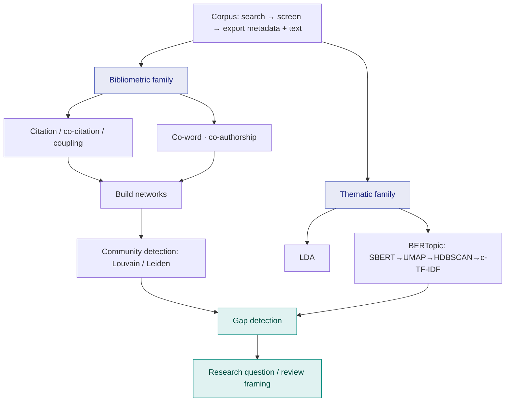
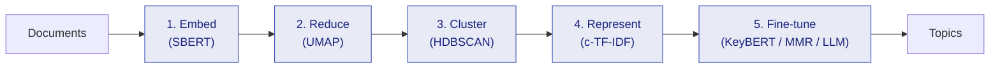
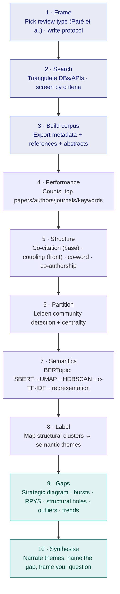

# A Field Manual for Bibliometric and Thematic Analysis: Tools, Algorithms, and When to Use Them

The [first post in this series](understanding-literature-reviews.md) was about the *idea* of a review —
why it's a research design and not a long introduction, and why its real value is integration rather
than enumeration. This post is the other half of that education: once you accept that a review must be
methodical and reproducible, **how do you actually map a literature that is far too large to hold in
one head?**

This is the manual I wish someone had handed me at the start of my first systematic review. It is
deliberately a *reference* rather than an essay — a map of the techniques, the algorithms underneath
them, and, for each, the only three questions that matter at the bench: **when, why, and how.**

<!-- more -->

!!! abstract "What this manual covers"
    1. **Pick the review first** — using a published *typology* of reviews to decide which kind you're doing.
    2. **The two families** — bibliometric (citation-structure) analysis vs. thematic (text-content) analysis, and where they meet.
    3. **Bibliometric building blocks** — citation, co-citation, bibliographic coupling, co-word, co-authorship.
    4. **Thematic & semantic analysis** — LDA, and then BERTopic in depth: SBERT → UMAP → HDBSCAN → c-TF-IDF → representation models.
    5. **Finding structure** — building networks and running Louvain / Leiden community detection; centrality measures.
    6. **Finding the gap** — strategic diagrams, burst detection, RPYS, structural holes, density outliers.
    7. **The toolchain** — bibliometrix, VOSviewer, CiteSpace, Gephi, and the Python stack.
    8. **An end-to-end workflow** that stitches it all together.

---

## Step 0 — Decide *which* review you are doing

Before any tool, a decision: **what kind of review is this?** The word "literature review" hides at
least a dozen distinct designs, each with its own goal, sampling logic, and standard of rigour. Doing
a bibliometric science-mapping study when the question actually called for a critical interpretive
synthesis is a category error no amount of clean code will fix.

The single most useful thing you can do here is read a **typology paper** and locate your study inside
it. For Information Systems, the canonical one is:

> Paré, G., Trudel, M.-C., Jaana, M., & Kitsiou, S. (2015). *Synthesizing information systems
> knowledge: A typology of literature reviews.* **Information & Management, 52(2)**, 183–199.
> [doi:10.1016/j.im.2014.08.008](https://doi.org/10.1016/j.im.2014.08.008)

Paré and colleagues classify reviews into **nine types** — narrative, descriptive, scoping/mapping,
*meta-analysis*, *qualitative systematic review*, *umbrella review*, *theoretical review*, *realist
review*, and *critical review* — and, crucially, they characterise each along dimensions like goal
(describe, test, understand, explain, critique), the role of theory, and whether the synthesis is
*aggregative* (pooling commensurable findings) or *interpretive* (building new understanding from
heterogeneous work). You read the table, you find the row that matches your question, and you inherit
a ready-made set of expectations about what your method has to deliver.

A second, field-agnostic companion is worth keeping next to it:

> Grant, M. J., & Booth, A. (2009). *A typology of reviews: an analysis of 14 review types and
> associated methodologies.* **Health Information & Libraries Journal, 26(2)**, 91–108.
> [doi:10.1111/j.1471-1842.2009.00848.x](https://doi.org/10.1111/j.1471-1842.2009.00848.x)

Grant & Booth give the **SALSA** mnemonic — **S**earch, **A**ppraisal, **S**ynthesis, **A**nalysis —
and grade each of 14 review types on how much of each it demands. It's the quickest way to sanity-check
whether the effort you're budgeting matches the review you've named.

!!! tip "How to actually use a typology"
    Don't read it as trivia. Read it as a **decision procedure**: (1) state your question; (2) find the
    review type whose *goal* matches it; (3) copy that row's expectations into your protocol as
    non-negotiables. Bibliometric and thematic methods below mostly serve **scoping/mapping reviews**
    and the descriptive front-end of larger reviews — they tell you *what is there and how it is
    structured* before you interpret it.

Two practical guides bridge the typology and the techniques in the rest of this manual, and I cite
them throughout:

> Zupic, I., & Čater, T. (2015). *Bibliometric methods in management and organization.* **Organizational
> Research Methods, 18(3)**, 429–472. [doi:10.1177/1094428114562629](https://doi.org/10.1177/1094428114562629)

> Donthu, N., Kumar, S., Mukherjee, D., Pandey, N., & Lim, W. M. (2021). *How to conduct a bibliometric
> analysis: An overview and guidelines.* **Journal of Business Research, 133**, 285–296.
> [doi:10.1016/j.jbusres.2021.04.070](https://doi.org/10.1016/j.jbusres.2021.04.070)

---

## The two families (and where they meet)

Everything that follows belongs to one of two families, and it helps to keep them straight.

| | **Bibliometric analysis** | **Thematic / content analysis** |
|---|---|---|
| **Reads** | metadata — citations, references, authors, keywords | the actual text — titles, abstracts, full text |
| **Asks** | how is the field *structured* and *connected*? | what is the field *about*? |
| **Unit** | documents, authors, journals as nodes in a network | words, sentences, documents as points in a semantic space |
| **Output** | maps, clusters, "schools of thought" | topics, themes, narratives |
| **Bias** | reflects *citing behaviour*, lags by years | reflects *language*, sensitive to preprocessing |

Bibliometrics is **structural** — it trusts that the community's citing and co-authoring behaviour
encodes the field's real intellectual geography. Thematic analysis is **semantic** — it reads what the
papers say. The two are complementary: bibliometrics tells you *which* clusters exist and how they
relate; thematic analysis tells you *what each cluster means*. A strong science-mapping review uses
both — structure to partition, semantics to label — which is exactly the workflow at the end.



---

## Part 1 — Bibliometric building blocks

These four (plus co-authorship) are the primitives. Every science-mapping tool is, underneath, just
choosing **what counts as a node and what counts as an edge** — and these are the standard choices.

### Citation analysis (direct citation)

- **What it measures.** Raw influence: who cites whom, and how often. Edge = "A cites B."
- **When/why.** The first pass. Most-cited papers, authors, and journals tell you the field's
  *foundations* and its current centre of gravity. Use it for a performance/impact snapshot.
- **How.** Count and rank. A *direct-citation network* (A→B directed edges across your corpus) can be
  community-detected to find clusters, and is the most *current* of the structural methods because it
  uses citations made *by* your corpus, not citations accumulated *over decades*.
- **Caveat.** Citation counts age — a 2024 paper hasn't had time to accumulate them. Never rank recent
  work by raw counts alone.

### Co-citation analysis — *Small (1973)*

- **What it measures.** Two documents are **co-cited** when a *third, later* document cites both. The
  more papers cite A and B together, the more the community treats them as intellectually related.
  Edge weight = number of papers citing both.

> Small, H. (1973). *Co-citation in the scientific literature: A new measure of the relationship between
> two documents.* **JASIS, 24(4)**, 265–269. [doi:10.1002/asi.4630240406](https://doi.org/10.1002/asi.4630240406)

- **When/why.** This is *the* method for mapping a field's **intellectual base** — its foundational
  knowledge and "schools of thought." Because co-citation is defined by *citing* papers, it surfaces
  the classics the community keeps reaching for together. Run it on **cited references** (papers your
  corpus cites) or on **authors** (author co-citation analysis, ACA, for schools of thought) or
  **journals** (to see the field's disciplinary base).
- **How.** Build a co-citation matrix from reference lists; the network's communities are the
  intellectual traditions. Strongest when your corpus is mature.
- **Caveat.** It is *backward-looking* by construction — it maps the canon, not the frontier. A paper
  needs years of accumulated co-citations to appear.

### Bibliographic coupling — *Kessler (1963)*

- **What it measures.** Two documents are **coupled** when they *share references*. The more references
  in common, the more related. It's the mirror image of co-citation.

> Kessler, M. M. (1963). *Bibliographic coupling between scientific papers.* **American Documentation,
> 14(1)**, 10–25. [doi:10.1002/asi.5090140103](https://doi.org/10.1002/asi.5090140103)

- **When/why.** This is the method for the **research front** — *current* activity. Because coupling is
  fixed at publication (the references never change), even a brand-new paper is fully coupled the day
  it appears. Use it to cluster *recent* literature into active research streams.
- **How vs. co-citation.** Memorise the contrast: **co-citation = shared *citers* (backward, the
  intellectual base); bibliographic coupling = shared *references* (forward, the research front).** Run
  coupling when your corpus is recent and you want today's active sub-communities; run co-citation when
  you want the historical foundations they all stand on.

### Co-word / co-keyword analysis — *Callon et al. (1983)*

- **What it measures.** The **conceptual** structure: words (author keywords, indexed keywords, or
  terms extracted from titles/abstracts) that **co-occur** in the same documents. Edge weight = number
  of documents in which two terms appear together.

> Callon, M., Courtial, J.-P., Turner, W. A., & Bauin, S. (1983). *From translations to problematic
> networks: An introduction to co-word analysis.* **Social Science Information, 22(2)**, 191–235.
> [doi:10.1177/053901883022002003](https://doi.org/10.1177/053901883022002003)

- **When/why.** This is the only one of the four that maps **content directly from metadata** — it
  shows the *topics* and how they relate, without needing the full text. It's the engine behind
  **thematic maps / strategic diagrams** (see [gap detection](#part-4-finding-the-gap)).
- **How.** Build a keyword co-occurrence matrix, normalise (the *association strength* / equivalence
  index is standard), cluster, and plot. Clean your keywords first — merge synonyms and plurals, or the
  map fractures into near-duplicates.
- **Caveat.** Author keywords are noisy and inconsistent; co-word analysis is only as good as your
  thesaurus.

### Co-authorship analysis

- **What it measures.** **Social** structure: who writes with whom. Nodes = authors (or institutions,
  or countries); edges = shared papers.
- **When/why.** To find research groups, collaboration clusters, and de Solla Price's **"invisible
  colleges"** — the informal communities that actually move a field. Community detection on the
  co-authorship graph recovers these groups; centrality finds the brokers who connect them.
- **How.** Standard network analysis (next section). Country/institution co-authorship is the usual way
  to show a field's geographic spread.

!!! note "Three structures, one field"
    Zupic & Čater (2015) frame bibliometric mapping as recovering three layered structures: the
    **intellectual** structure (co-citation), the **conceptual** structure (co-word), and the **social**
    structure (co-authorship). A thorough science-mapping review reports all three.

---

## Part 2 — Thematic & semantic analysis

Bibliometrics maps the *scaffolding*. To say what the field is actually *about*, you read the text.

### LDA — the classic baseline

**Latent Dirichlet Allocation** (Blei, Ng & Jordan, 2003) treats each document as a mixture of latent
topics, and each topic as a distribution over words. For two decades it was the default for topic
modelling a corpus of abstracts.

- **When/why.** A reasonable, cheap baseline; well understood; produces soft (mixed-membership) topics,
  which is genuinely useful when documents really do span themes.
- **The pain.** It's **bag-of-words** — it ignores word order and meaning, so "bank" the institution and
  "bank" the river collapse together. You must pre-specify the number of topics $k$, coherence is
  fiddly, short texts (abstracts!) are weak, and the topics often need heavy interpretation. Modern
  embedding-based methods fix most of this — which is why the rest of this section is about BERTopic.

### BERTopic — the modern pipeline, in depth

> Grootendorst, M. (2022). *BERTopic: Neural topic modeling with a class-based TF-IDF procedure.*
> arXiv:2203.05794. [arxiv.org/abs/2203.05794](https://arxiv.org/abs/2203.05794)

BERTopic is not one model; it is a **pipeline of swappable modules**, and understanding it module by
module is what lets you tune it instead of cargo-culting defaults. The stages:



**1. Embed — Sentence-BERT (SBERT).** Each document becomes a dense vector (typically 384 or 768
dimensions) that encodes *meaning*: papers about "user resistance to enterprise systems" land near
papers about "technology adoption refusal" even with zero shared words. This is the leap over LDA.

> Reimers, N., & Gurevych, I. (2019). *Sentence-BERT: Sentence embeddings using Siamese BERT-networks.*
> **EMNLP 2019.** [arxiv.org/abs/1908.10084](https://arxiv.org/abs/1908.10084)

**2. Reduce dimensionality — UMAP.** You cannot cluster 384-dimensional vectors well: in high
dimensions distances concentrate (the curse of dimensionality) and density-based clustering fails.
**UMAP** projects the embeddings down to a handful of dimensions while *preserving local and much of
the global structure* — far better than t-SNE at keeping the macro-shape, and fast.

> McInnes, L., Healy, J., & Melville, J. (2018). *UMAP: Uniform Manifold Approximation and Projection
> for Dimension Reduction.* arXiv:1802.03426. [arxiv.org/abs/1802.03426](https://arxiv.org/abs/1802.03426)

The knobs that matter:

- `n_neighbors` — the local/global trade-off. **Low (≈5–15)** preserves fine local structure → more,
  smaller topics. **High (≈30–50)** preserves global structure → fewer, broader themes. This is your
  main "topic granularity" dial.
- `n_components` — target dimensions. **5** is the BERTopic default for *clustering* (HDBSCAN likes
  low dimensions); use **2** only for *plotting*.
- `metric='cosine'` — embeddings are directional; cosine, not Euclidean.
- `min_dist` — keep it low (≈0.0) for clustering so points can pack tightly; raise it only for
  visual separation in plots.

!!! warning "Reproducibility footgun"
    UMAP is stochastic. Fix `random_state` or your topics shift between runs — fatal for a review you
    need to *reproduce*. Note that fixing the seed disables UMAP's parallelism, so it's slower.

**3. Cluster — HDBSCAN.** **Hierarchical Density-Based Spatial Clustering of Applications with Noise**
finds clusters as *dense regions* separated by sparse ones. Two properties make it ideal here:

> McInnes, L., Healy, J., & Astels, S. (2017). *hdbscan: Hierarchical density based clustering.*
> **Journal of Open Source Software, 2(11)**, 205. [doi:10.21105/joss.00205](https://doi.org/10.21105/joss.00205)

- **It does not force $k$.** Unlike k-means or LDA, you never declare how many topics exist — it finds
  them from the data. The right number of themes is a *result*, not an input.
- **It allows outliers.** Documents in no dense region get label **`-1`** (noise) instead of being
  jammed into the nearest cluster. This is a feature, not a bug — see the gap-detection section, where
  those outliers are candidate *under-researched* work.

Key knob: `min_cluster_size` — the smallest group you'll call a topic. **Larger → fewer, bigger
themes; smaller → more, finer themes.** It's the second granularity dial alongside UMAP's `n_neighbors`.
(`min_samples` controls how conservative the noise labelling is — raise it for more outliers, lower for
fewer.)

**4. Represent — class-based TF-IDF (c-TF-IDF).** Now each cluster needs words. BERTopic concatenates
all documents in a cluster into one "class document" and computes a class-based TF-IDF: a term scores
high for a topic if it's frequent *in that topic* but rare *across topics*.

$$ W_{t,c} = \text{tf}_{t,c} \times \log\!\left(1 + \frac{A}{f_t}\right) $$

where $\text{tf}_{t,c}$ is the frequency of term $t$ in class $c$, $A$ is the average number of words
per class, and $f_t$ is the frequency of $t$ across all classes. The top-weighted terms become the
topic's keywords.

**5. Fine-tune the theme — representation models.** This is the stage the user asked me to be explicit
about, and it's the one most people skip. c-TF-IDF gives you keywords, but they're often redundant
("model, models, modeling") or generic. BERTopic lets you **stack a representation model** on top of
c-TF-IDF to *enhance the theme* without re-clustering:

- **`KeyBERTInspired`** — re-ranks candidate keywords by the *semantic similarity* of each word's
  embedding to the topic's embedding. Cuts noise, surfaces words that are actually *about* the theme,
  not just frequent.
- **`MaximalMarginalRelevance` (MMR)** — diversifies the keyword list, trading off relevance against
  redundancy via $\lambda$. Use it to stop a topic being described by ten synonyms of the same idea.
- **`PartOfSpeech`** — keeps only nouns / meaningful POS patterns, so labels read like concepts, not
  function words.
- **Generative / LLM representation** — feed the top documents and keywords of each cluster to an LLM
  and ask for a short, human-readable *label* (e.g., "Trust calibration in AI-assisted decisions"
  instead of `trust, ai, decision, user, system`). This is the cleanest way to turn raw clusters into
  themes a reader recognises.

```python
from bertopic import BERTopic
from sentence_transformers import SentenceTransformer
from umap import UMAP
from hdbscan import HDBSCAN
from bertopic.representation import KeyBERTInspired, MaximalMarginalRelevance

# 1. semantic embeddings
embeddings = SentenceTransformer("all-MiniLM-L6-v2")

# 2. reduce — fix random_state for a reproducible review
umap = UMAP(n_neighbors=15, n_components=5, min_dist=0.0,
            metric="cosine", random_state=42)

# 3. density clustering — no k required; -1 = outliers
hdbscan = HDBSCAN(min_cluster_size=15, metric="euclidean",
                  cluster_selection_method="eom", prediction_data=True)

# 5. stack representation models to enhance the themes (4. c-TF-IDF is built in)
representation = [KeyBERTInspired(), MaximalMarginalRelevance(diversity=0.4)]

topic_model = BERTopic(
    embedding_model=embeddings,
    umap_model=umap,
    hdbscan_model=hdbscan,
    representation_model=representation,
    calculate_probabilities=True,
)
topics, probs = topic_model.fit_transform(documents)
```

!!! tip "BERTopic for a review, specifically"
    - Embed **title + abstract + author keywords** concatenated — abstracts alone are short and noisy.
    - Use **`topics_over_time`** to watch themes *rise and fall* across years — direct evidence of
      emerging vs. saturating areas.
    - Treat the **`-1` outlier set** as a deliberate output, not garbage: scan it for genuinely novel
      or orphan work.
    - Report your UMAP/HDBSCAN parameters and the random seed in the methods section. That *is* the
      reproducibility the [first post](understanding-literature-reviews.md) insisted on.

### Semantic similarity maps

Independently of clustering, the SBERT embeddings let you build a **document-similarity** view: project
to 2-D with UMAP and plot, or compute nearest-neighbours to find the papers most similar to a seed
paper. Useful for *snowball* searching (find what you missed) and for sanity-checking that your
clusters separate visually.

---

## Part 3 — Finding structure: networks & community detection

Three of the bibliometric primitives (co-citation, coupling, co-word, co-authorship) produce a
**weighted graph**. The structure you're after — the *schools of thought*, the sub-fields — is found by
partitioning that graph into **communities**: groups of nodes densely connected inside, sparsely
connected outside.

### The objective: modularity

Most community-detection algorithms optimise **modularity** $Q$ — how much more densely connected a
proposed partition is than you'd expect by chance:

$$ Q = \frac{1}{2m} \sum_{ij} \left[ A_{ij} - \frac{k_i k_j}{2m} \right] \delta(c_i, c_j) $$

where $A_{ij}$ is the edge weight between $i$ and $j$, $k_i$ the (weighted) degree of $i$, $m$ the
total edge weight, and $\delta(c_i, c_j)=1$ when $i$ and $j$ are in the same community. Higher $Q$ =
crisper community structure.

### Louvain — *Blondel et al. (2008)*

> Blondel, V. D., Guillaume, J.-L., Lambiotte, R., & Lefebvre, E. (2008). *Fast unfolding of communities
> in large networks.* **J. Stat. Mech.**, P10008. [doi:10.1088/1742-5468/2008/10/P10008](https://doi.org/10.1088/1742-5468/2008/10/P10008)

A fast, greedy, multi-level heuristic: locally move nodes to maximise $Q$, collapse each community into
a super-node, repeat. It made community detection feasible on large networks and is everywhere
(Gephi's default "modularity").

- **When/why.** Quick, scalable, good-enough partitions for exploration.
- **The flaw.** Louvain can produce **badly connected — even internally disconnected — communities**:
  a "community" that is actually two pieces the algorithm never noticed it split.

### Leiden — *Traag, Waltman & van Eck (2019)* ← prefer this one

> Traag, V. A., Waltman, L., & van Eck, N. J. (2019). *From Louvain to Leiden: guaranteeing
> well-connected communities.* **Scientific Reports, 9**, 5233.
> [doi:10.1038/s41598-019-41695-z](https://doi.org/10.1038/s41598-019-41695-z)

The **Leiden** algorithm fixes exactly that defect. It adds a *refinement* step that **guarantees every
community is internally connected**, converges to better partitions, and is faster on large graphs. If
you have a choice — and in Python (`leidenalg` / `igraph`) you do — **use Leiden, not Louvain.** It is
the current default for serious science mapping.

- **When/why.** Whenever you partition a co-citation, coupling, co-word, or co-authorship network into
  communities and want the result to be *trustworthy* and reproducible.
- **How.** Run it on the weighted graph; tune the **resolution** parameter — *higher resolution → more,
  smaller communities; lower → fewer, larger* (the structural analogue of UMAP `n_neighbors` and
  HDBSCAN `min_cluster_size`). Use **CPM** (Constant Potts Model) instead of modularity if you want to
  sidestep modularity's *resolution limit*, which can hide small but real communities inside big ones.

!!! note "A note on the name"
    People sometimes call this "Levine's algorithm" — it's **Leiden**, named for the Dutch university,
    by Traag and colleagues. Worth getting right in a methods section. (The earlier **Louvain**
    algorithm is likewise named for a university, in Belgium.)

### Centrality — who matters, and how

Once you have communities, **centrality** tells you the role each node plays. The four you'll actually
report:

- **Degree centrality** — raw connectedness. High-degree nodes are the *hubs* (the heavily co-cited
  classics, the prolific collaborators).
- **Betweenness centrality** — how often a node lies on shortest paths between others. **High
  betweenness = a broker** spanning otherwise separate communities. These nodes are gold: they're the
  papers/authors *bridging* sub-fields, and the bridges that *don't yet exist* are research gaps (see
  structural holes below). CiteSpace highlights high-betweenness nodes with purple rings as "pivotal."
- **Closeness centrality** — how near a node is to all others; proxies how quickly an idea reaches the
  whole field.
- **Eigenvector / PageRank** — connectedness *weighted by your neighbours' importance*. Distinguishes
  "cited by many" from "cited by the *important* many."

---

## Part 4 — Finding the gap

This is the payoff — the part of a review that launches your *own* study. A gap isn't a vibe; several
algorithms make it visible. Here are the ones worth knowing, each with its tell-tale signature.

### 1. Strategic diagrams / thematic maps (co-word quadrants)

From co-word analysis (Callon et al., 1983; operationalised in SciMAT by Cobo et al., 2011), each theme
cluster is plotted on two axes:

- **Centrality** (x) — how connected the theme is to others = its *importance* to the field.
- **Density** (y) — how internally cohesive the theme is = its *development*.

> Cobo, M. J., López-Herrera, A. G., Herrera-Viedma, E., & Herrera, F. (2011). *An approach for
> detecting, quantifying, and visualizing the evolution of a research field: SciMAT.* **Journal of
> Informetrics, 5(1)**, 146–166. [doi:10.1016/j.joi.2010.10.002](https://doi.org/10.1016/j.joi.2010.10.002)

The four quadrants — and what each means for a gap:

| Quadrant | Centrality | Density | Reading | Gap signal |
|---|---|---|---|---|
| **Motor themes** | high | high | important *and* well-developed | mature — little room |
| **Basic / transversal** | high | low | important but *underdeveloped* | **strong gap** — matters, under-built |
| **Niche themes** | low | high | developed but isolated/specialised | bridge-building opportunity |
| **Emerging or declining** | low | low | marginal, weakly developed | **watch** — emerging (gap) or dying |

The **basic-but-underdeveloped** and **emerging** quadrants are where review-driven research questions
live. `bibliometrix`/`biblioshiny` draws this map directly.

### 2. Burst detection — *Kleinberg (2003)*

> Kleinberg, J. (2003). *Bursty and hierarchical structure in streams.* **Data Mining and Knowledge
> Discovery, 7(4)**, 373–397. [doi:10.1023/A:1024940629314](https://doi.org/10.1023/A:1024940629314)

Kleinberg's burst-detection models a term's (or citation's) arrival rate as a state machine and flags
**bursts** — intervals where frequency spikes far above baseline. In **CiteSpace** this surfaces
*citation bursts* (references suddenly cited a lot) and *keyword bursts* (terms suddenly trending).

- **When/why.** To detect **emerging trends and turning points** — the frontier, not the canon. A
  keyword that just started bursting is a live area; a gap often sits *next to* a fresh burst.

> Chen, C. (2006). *CiteSpace II: Detecting and visualizing emerging trends and transient patterns in
> scientific literature.* **JASIST, 57(3)**, 359–377. [doi:10.1002/asi.20317](https://doi.org/10.1002/asi.20317)

### 3. RPYS — reference publication year spectroscopy

> Marx, W., Bornmann, L., Barth, A., & Leydesdorff, L. (2014). *Detecting the historical roots of
> research fields by RPYS.* **JASIST, 65(4)**, 751–764. [doi:10.1002/asi.23089](https://doi.org/10.1002/asi.23089)

RPYS plots the distribution of the *publication years of the references* your corpus cites. **Peaks**
mark the seminal works the field is built on. Useful for the *intellectual-roots* narrative — and the
*quiet* periods between peaks can flag foundations a field has *forgotten* or never consolidated.

### 4. Structural holes & bridge gaps — *Burt (1992)*

A **structural hole** is a missing edge between two clusters that *aren't* connected but plausibly
should be. In a co-citation or co-word map, two dense communities with **no high-betweenness node
bridging them** is a literal, visual gap: two conversations that have not yet been brought into contact.
Many strong review contributions are exactly this — "field A and field B both study X but never cite
each other." Find them by spotting communities with low inter-cluster edge weight and absent brokers.

> Burt, R. S. (1992). *Structural Holes: The Social Structure of Competition.* Harvard University Press.

### 5. Density outliers — HDBSCAN's `-1`

The documents BERTopic labels **`-1`** sit in *sparse* regions of semantic space — by definition,
work the literature hasn't clustered densely around. After filtering genuine noise, the remainder is a
shortlist of **under-researched or boundary-spanning** papers: candidate gaps that the structural
methods, which need accumulated citations, are too slow to see.

### 6. Temporal topic evolution

BERTopic's `topics_over_time`, CiteSpace's time-sliced networks, and SciMAT's thematic-evolution maps
all answer the same question: **which themes are growing, splitting, merging, or dying?** A theme with
rising volume but still-low density (few connections) is an *emerging* gap; a once-motor theme losing
volume is *saturating*. Trend direction, not just current size, is what tells you where to place your
own work.

!!! abstract "Gap-detection cheat sheet"
    | You want to find… | Use | Signature |
    |---|---|---|
    | Important-but-underdeveloped areas | Strategic diagram | basic/emerging quadrant |
    | Sudden new trends | Burst detection (CiteSpace) | keyword/citation burst |
    | Forgotten foundations | RPYS | gaps between reference-year peaks |
    | Disconnected conversations | Structural holes / betweenness | two clusters, no bridge |
    | Novel / orphan work | HDBSCAN outliers | `-1` label in sparse space |
    | Rising vs. dying themes | Topics-over-time / thematic evolution | trend slope |

---

## Part 5 — The toolchain

You do not need to build any of this from scratch. The mature tools:

| Tool | Kind | Best for | Notes |
|---|---|---|---|
| **bibliometrix / biblioshiny** | R package + GUI | the full bibliometric workflow — co-citation, coupling, co-word, **thematic maps**, three-fields plots | Aria & Cuccurullo (2017); `biblioshiny` is the point-and-click front end |
| **VOSviewer** | Java GUI | beautiful **co-citation / coupling / co-word maps**, density visualisations | van Eck & Waltman (2010); its clustering is a *smart-local-moving* (Leiden-family) variant |
| **CiteSpace** | Java GUI | **burst detection**, time-sliced networks, betweenness "pivot" nodes | Chen (2006); the go-to for *emerging trends* |
| **Gephi** | network GUI | general network viz + **Louvain modularity**, layouts | swap in Leiden via plugins/scripts where you can |
| **Python stack** | code | end-to-end, reproducible, **BERTopic** + custom analysis | `bertopic`, `sentence-transformers`, `umap-learn`, `hdbscan`, `networkx`/`igraph`, `leidenalg` |
| **OpenAlex / Semantic Scholar APIs** | data | programmatic, *free* corpus building with references & citations | the open backbone for reproducible search (see the [first post's source list](understanding-literature-reviews.md)) |

> Aria, M., & Cuccurullo, C. (2017). *bibliometrix: An R-tool for comprehensive science mapping
> analysis.* **Journal of Informetrics, 11(4)**, 959–975. [doi:10.1016/j.joi.2017.08.007](https://doi.org/10.1016/j.joi.2017.08.007)

> van Eck, N. J., & Waltman, L. (2010). *Software survey: VOSviewer, a computer program for bibliometric
> mapping.* **Scientometrics, 84(2)**, 523–538. [doi:10.1007/s11192-009-0146-3](https://doi.org/10.1007/s11192-009-0146-3)

**A reasonable division of labour:** `biblioshiny` for the structural maps and thematic diagram (fast,
publication-ready), **CiteSpace** for burst/trend detection, and **Python + BERTopic** for the semantic
themes and anything you need to be *exactly* reproducible. Export from one, import into the next.

---

## Part 6 — Stitching it together: an end-to-end workflow

The whole manual, in the order you'd actually run it:



The discipline from the [first post](understanding-literature-reviews.md) applies to every box: set
criteria *before* you look, record every parameter and decision, fix your random seeds, and report it
all so another researcher could reproduce the map. Bibliometric and thematic methods don't replace the
*judge-and-jury* judgement at the heart of a review — they make the field **legible enough** that the
judgement is honest, defensible, and reproducible.

---

## Takeaways

- **Choose the review type first.** Use a published typology (Paré et al., 2015; Grant & Booth, 2009) as
  a decision procedure, not trivia. Most of these methods serve **scoping/mapping** reviews.
- **Two families.** Bibliometrics maps *structure* from metadata; thematic analysis reads *meaning* from
  text. Strong reviews use structure to partition and semantics to label.
- **Know your four primitives.** **Co-citation** = shared citers (the intellectual *base*, backward);
  **bibliographic coupling** = shared references (the research *front*, forward); **co-word** = the
  conceptual map; **co-authorship** = the social map.
- **BERTopic is a pipeline, not a black box.** SBERT for meaning → **UMAP** to reduce (tune
  `n_neighbors`) → **HDBSCAN** to cluster with *no fixed k* and honest **`-1` outliers** → **c-TF-IDF**
  for keywords → a **representation model** (KeyBERT / MMR / LLM) to *enhance the theme*.
- **Detect communities with Leiden, not Louvain.** Leiden guarantees well-connected communities; tune
  resolution for granularity; report centrality (betweenness finds the brokers).
- **Gaps have algorithmic signatures.** Underdeveloped quadrants on a strategic diagram, Kleinberg
  bursts, RPYS valleys, structural holes between clusters, HDBSCAN outliers, and rising-but-thin
  themes — each names a different *kind* of gap.
- **Use the mature tools.** biblioshiny + CiteSpace + Python/BERTopic, fed by free APIs like OpenAlex —
  and write down every parameter so the map is reproducible.

---

*This is the second post in the series on literature reviews and research synthesis. The
[first](understanding-literature-reviews.md) was about why a review is a research design; this one is
the computational toolkit for actually mapping a field. Next, I want to take a single real corpus —
my own SLR — through this entire pipeline end to end, and show the maps it produces.*
