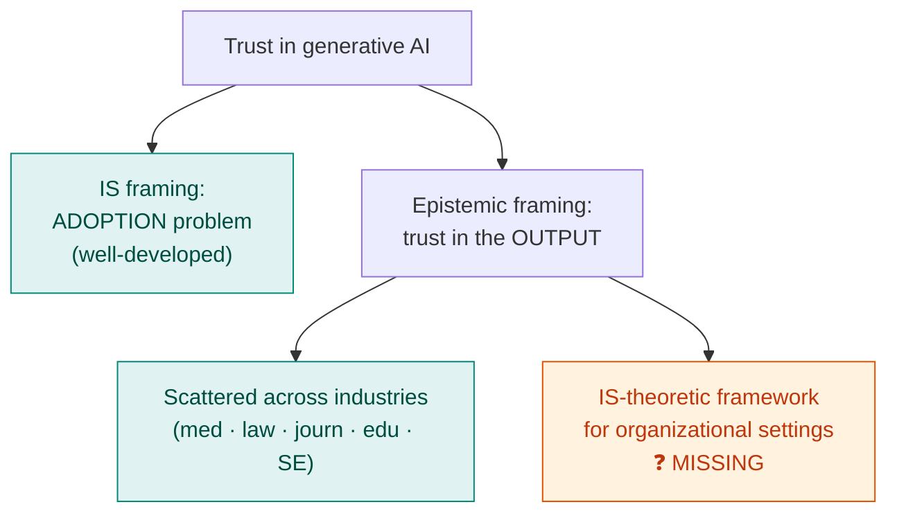
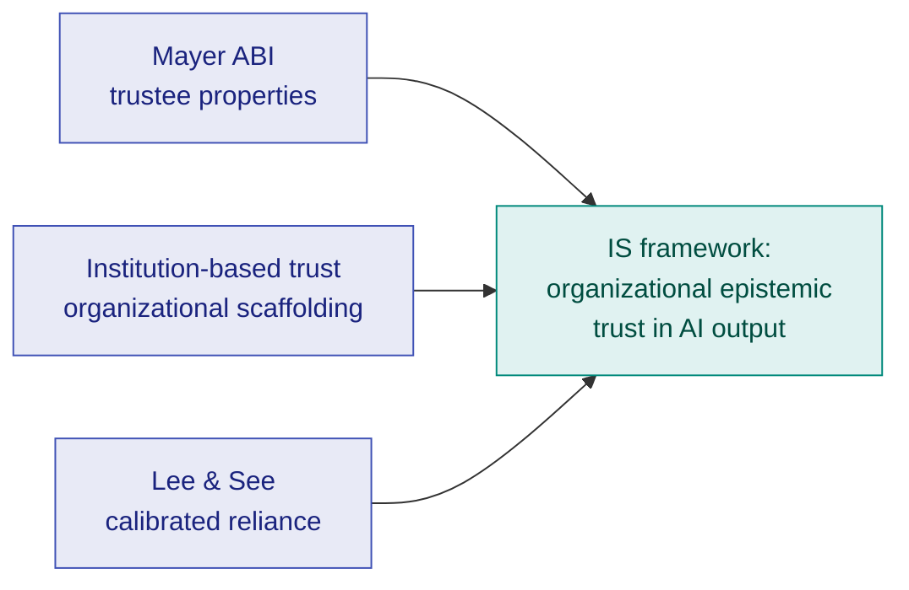

# When Trust Becomes Epistemic: A Gap in How IS Studies Generative AI

This is the first entry in a new **Research Log** — a place to document research as it actually
unfolds: arguments, dead-ends, emerging findings, and evolving frameworks. Not polished outputs —
working notes that are provisional, citable, and revised as the work grows.

The question I started from is narrow and, I think, important: **how do organizations come to trust —
or distrust — the *content that generative AI produces*?** Not whether they adopt the tools. Whether
they believe what the tools *say*. That distinction turned out to be the whole story.

<!-- more -->

!!! note "Status: preliminary"
    These are early findings from a still-growing corpus, written to be argued with. The bibliometric
    machinery behind them — co-citation maps, BERTopic themes, thematic strategic diagrams — is the
    subject of the [field-manual post](bibliometric-analysis-field-manual.md); here I'm reporting what
    that machinery started to *show*. The completed study is documented in [Research Log #2](research-log-2-trust-bifurcation-generative-ai.md).

## Two different things we call "trust"

Most of the confusion in this literature dissolves once you separate two questions that the word
"trust" quietly fuses together:

- **Adoption trust** — *will I use this system?* Trust here is an antecedent of behaviour: a
  determinant in the lineage of TAM, UTAUT, and the IS trust models, sitting alongside perceived
  usefulness and ease of use, predicting intention to adopt.
- **Epistemic trust** — *should I believe what this system tells me?* Trust here is about the system as
  a **source of knowledge** — a testifier whose claims I might accept, doubt, or verify. It governs
  *reliance on the output*, not acceptance of the tool.

These are not the same construct, and conflating them is consequential. A clinician can wholeheartedly
*adopt* an AI scribe (high adoption trust) while being entirely right to *distrust any given sentence*
it generates (low, well-calibrated epistemic trust). Generative AI is the first workplace technology
where this split is the *normal* case rather than an edge case, because its core output is
**fluent, plausible, and not reliably true**. Fluency decouples persuasiveness from accuracy — and that
is precisely an epistemic problem, not an adoption one.

The philosophical roots are older than the technology. Epistemic trust is the trust we place in others
*as sources of knowledge* — the basis of accepting testimony we cannot independently verify (Hardwig,
1991), policed in ordinary communication by mechanisms of **epistemic vigilance** (Sperber et al.,
2010). Generative AI breaks the assumptions those mechanisms rely on: there is no human source with a
competence or an honesty to assess, yet the output wears all the linguistic signals of both.

> Hardwig, J. (1991). *The role of trust in knowledge.* **The Journal of Philosophy, 88(12)**, 693–708.
> [doi:10.2307/2027007](https://doi.org/10.2307/2027007)

> Sperber, D., Clément, F., Heintz, C., Mascaro, O., Mercier, H., Origgi, G., & Wilson, D. (2010).
> *Epistemic vigilance.* **Mind & Language, 25(4)**, 359–393.
> [doi:10.1111/j.1468-0017.2010.01394.x](https://doi.org/10.1111/j.1468-0017.2010.01394.x)

## What the literature actually does — and where it splits

Here is the pattern I keep seeing in the corpus, and it has a clean shape:

1. **The concern is everywhere — *outside* IS.** Trust in AI-generated content is being actively
   discussed across industry and domain literatures: medicine, law, journalism, education, software
   engineering, finance. In each, practitioners are worrying, in their own vocabulary, about believing
   machine output. The concern is real and broad.

2. **Inside IS, trust in GenAI is framed as *adoption*.** When the IS literature engages generative AI
   and trust, it overwhelmingly does so through the **adoption** lens — trust as an antecedent of use
   intention. That framing is doing what IS trust research has always done well (McKnight et al., 2002;
   the long TAM/UTAUT tradition), but it answers the *wrong question* for this technology. **Trust in
   the output itself is studied only sparsely.**

3. **The epistemic question is exploding — but fragmented.** There is a recent, fast-growing body of
   work that *does* take the epistemic problem seriously. But it is **context-bound and scattered**:
   a study of radiologists trusting diagnostic suggestions here, of lawyers trusting drafted briefs
   there, of students trusting AI tutors elsewhere. Each is anchored to its industry. What's missing is
   the layer *above* them.

## The gap, stated precisely

So the gap is not "nobody studies trust in AI." It is sharper than that:

> There is no **information-systems-theoretic framework** for how **epistemic trust in AI-generated
> content** forms, operates, and is governed **in organizational settings**. The phenomenon is studied
> richly but in industry silos; IS, which owns the organizational-technology lens, has been looking at
> the adjacent (adoption) question instead.

This is the kind of gap the [first post](understanding-literature-reviews.md) called the most valuable
thing a review can surface: not an absence of attention, but a **bifurcation** — two literatures that
should be in contact and aren't. On one side, a mature IS tradition of trust *theory* aimed at
adoption. On the other, a burst of empirical, epistemic, context-specific work with no shared
theoretical spine. The contribution is to build the bridge.

## The bridge: three trust theories that already fit

What surprised me — and what makes me think this is tractable rather than just a complaint — is that
the theoretical apparatus for the bridge **already exists** in the classical trust literature. Three
frameworks map onto organizational epistemic trust in GenAI almost directly, each covering a different
facet:

### Mayer, Davis & Schoorman's ABI model — *the trustee's properties*

> Mayer, R. C., Davis, J. H., & Schoorman, F. D. (1995). *An integrative model of organizational trust.*
> **Academy of Management Review, 20(3)**, 709–734. [doi:10.2307/258792](https://doi.org/10.2307/258792)

ABI decomposes trustworthiness into **Ability, Benevolence, Integrity**, with trust enabling
risk-taking under perceived risk. Re-read for AI-generated content, it becomes a diagnostic — and a
*productive friction*:

- **Ability** → the model's competence/accuracy on *this* task. Maps cleanly, and is exactly what
  fluency masks.
- **Integrity** → consistency, adherence to stated principles, predictability of behaviour. Maps
  reasonably — and connects to alignment and guardrails.
- **Benevolence** → goodwill toward the truster. This is where it *strains*: a model has no goodwill,
  which forces the interesting question of whether organizational benevolence relocates to the
  *vendor* or the *deploying organization*. That strain is itself a research finding.

### Institution-based trust — *the organizational scaffolding*

> McKnight, D. H., Cummings, L. L., & Chervany, N. L. (1998). *Initial trust formation in new
> organizational relationships.* **Academy of Management Review, 23(3)**, 473–490.
> [doi:10.2307/259290](https://doi.org/10.2307/259290)

McKnight and colleagues' **institution-based trust** — *structural assurances* and *situational
normality* — explains why people extend trust before any direct experience. In organizations, trust in
AI output is never just dyadic: it is shaped by procurement, governance policy, sanctioned use,
vendor reputation, and audit. Institution-based trust is the construct that carries the **organizational
context** the IS lens is supposed to contribute, and which the industry-silo studies mostly hold fixed.

### Lee & See's trust calibration — *appropriate reliance on the output*

> Lee, J. D., & See, K. A. (2004). *Trust in automation: Designing for appropriate reliance.*
> **Human Factors, 46(1)**, 50–80. [doi:10.1518/hfes.46.1.50_30392](https://doi.org/10.1518/hfes.46.1.50_30392)

This is the most direct bridge of the three, because it is *already* about reliance on machine output.
Lee & See's central idea is **calibration** — trust should *match* the system's actual capability.
**Over-trust → misuse** (believing a hallucination); **under-trust → disuse** (ignoring a correct
answer). Their vocabulary of *calibration, resolution, and specificity of trust* is built for exactly
the epistemic question: not "do you trust the AI" but "do you trust *this output, this much, here.*"
For a fluent-but-unreliable generator, calibrated epistemic trust is the whole game.

!!! abstract "How the three combine"
    They aren't competitors — they're **layers**. ABI describes the *properties of the trustee* (the
    model/vendor); institution-based trust describes the *organizational scaffolding* that licenses
    trust before experience; Lee & See describe the *moment-to-moment calibration* of reliance on
    actual output. Stacked, they sketch a candidate IS framework: organizational epistemic trust in
    AI-generated content as a function of perceived model trustworthiness, institutional assurances,
    and calibrated reliance — the bridge across the bifurcation.

## Where this goes next

This entry stakes a claim; it doesn't yet prove it. The next moves in the log:

- **Quantify the bifurcation.** Use co-word and BERTopic analysis on the corpus to *show* the
  adoption-vs-epistemic split and the recent epistemic burst, rather than just asserting it — exactly
  the [gap-detection methods](bibliometric-analysis-field-manual.md#part-4-finding-the-gap) (strategic
  diagrams, burst detection, structural holes between the IS-adoption and industry-epistemic clusters).
- **Map the silos.** Co-citation / bibliographic-coupling maps to confirm the industry-specific studies
  really do form separate communities with weak bridges to IS trust theory.
- **Formalize the framework.** Turn the three-layer sketch above into propositions an empirical IS study
  could test.

If the maps confirm the shape, the gap is real and the bridge is buildable — and that is a research
programme, not just a literature review.

---

*Research Log · Entry 1. These notes accompany an in-progress systematic literature review on epistemic
trust in generative AI in organizations. They will be revised as the corpus and the analysis grow.*
