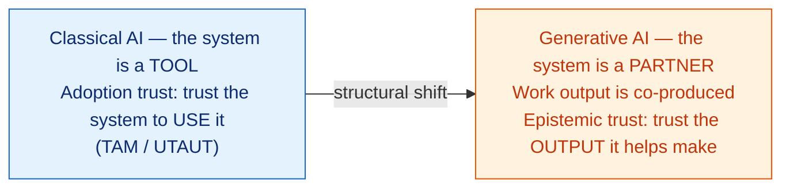
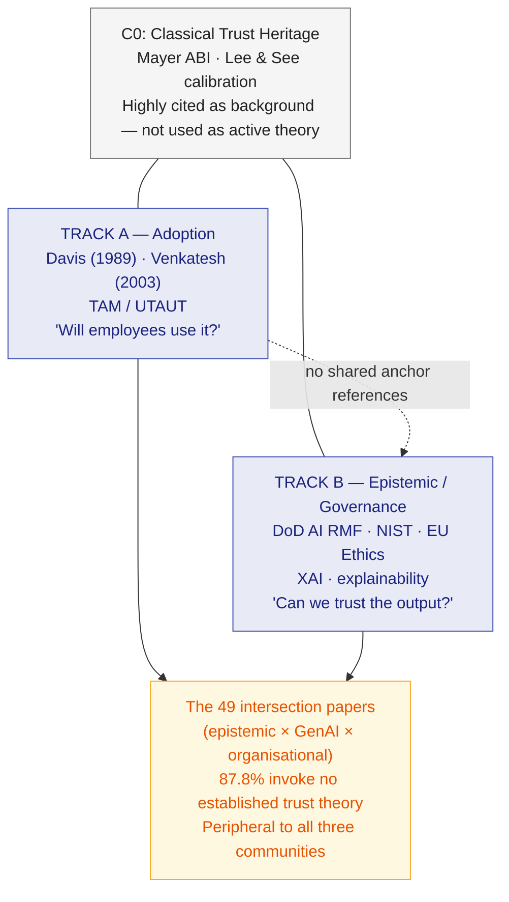
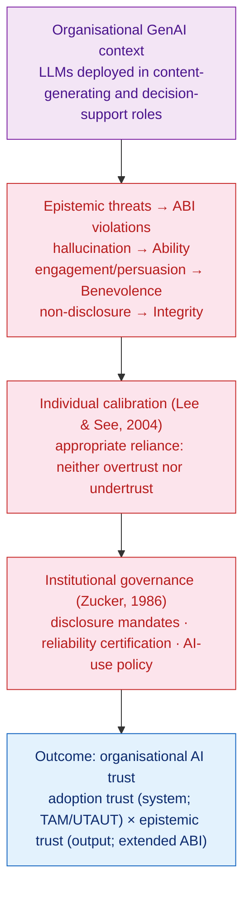

# Research Log #2: The Literature Has Split — How IS Lost the Thread on Epistemic Trust in AI

[Research Log #1](epistemic-trust-generative-ai-gap.md) announced a gap as a preliminary observation from a growing corpus. This entry reports the completed study.

The paper, submitted on June 12, 2026, draws on 3,443 Scopus-indexed publications on trust in AI. It applies three independent bibliometric lenses — co-citation analysis, keyword co-occurrence analysis, and BERTopic topic modelling — to the same corpus, and all three return the same structure: a field that has divided into two conversations that barely read each other. The division is not accidental. It has consequences.

<!-- more -->

!!! note "Status: completed"
    The underlying academic report, *From Adopting AI to Trusting Its Output: A Bibliometric and Thematic Review of Trust in AI in Organizations*, was submitted on June 12, 2026, under the guidance of Prof. Siddharth Gaurav Majhi at IIM Sambalpur. This entry documents the central finding and its implications for the ongoing research programme.

## The shift that started everything

[Log #1](epistemic-trust-generative-ai-gap.md) separated two questions that the word "trust" quietly fuses together. The separation is worth restating here, because none of the bibliometric findings make sense without it.

For most of the history of information systems research, AI was a **tool**. A diagnostic model returns a flag; a credit-scoring system returns a number. The human decides whether to act on it. Trust in this setting is an antecedent of use — a precondition for picking up the tool, theorised through the Technology Acceptance Model (Davis, 1989) and the Unified Theory of Acceptance and Use of Technology (Venkatesh et al., 2003). The system sits in the background as an object to be accepted or declined.

Generative AI changes this arrangement structurally. When an employee prompts a large language model to draft a report clause, summarise a filing, or produce a first version of a board note, the system is no longer waiting at the boundary of the task; it has moved inside it. What the worker now holds is **co-produced work** — something partly authored by a system whose competence they cannot audit and whose errors they cannot reliably detect by inspection alone.

This shift is why the trust question has a different shape for generative AI. The relevant question is no longer only whether the radiologist will rely on the model; it is whether a journalist can rely on an AI-drafted story as accurate, or a compliance officer on an AI-written summary as complete. **Adoption has already occurred. What is being evaluated is the output.** And the output — unlike a diagnostic flag — is fluent, confident, and not reliably true. Fluency decouples persuasiveness from accuracy. That is precisely an epistemic problem, not an adoption one.

## What the bibliometric evidence shows

The corpus covers 3,443 peer-reviewed publications, of which 98.8 per cent appeared from 2020 onwards. This is overwhelmingly a post-ChatGPT field; there was essentially no literature to map before large language models reached the public. Annual volume climbed from 51 papers in 2020 to 1,974 in 2025.

Three methods were applied to the corpus independently. Co-citation analysis mapped citation neighbourhoods of highly cited references. Keyword co-occurrence analysis mapped the vocabulary authors use to describe their own work. BERTopic modelling grouped 3,225 peer-reviewed abstracts into semantic themes. All three return the same picture.

### A field with three communities — and no bridges

Co-citation analysis recovers three communities:

| Community | Anchor references | Tradition |
|-----------|------------------|-----------|
| C0 Classical trust heritage | Mayer et al. (1995); Lee & See (2004) | Cited as background, rarely used |
| C1 TAM / UTAUT | Davis (1989); Venkatesh et al. (2003) | Adoption |
| C2 XAI and AI policy | DoD AI RMF; NIST AI RMF; EU AI Ethics Guidelines | Epistemic / governance |

The decisive observation is structural: **C1 and C2 share no anchor references.** Researchers who cite Davis (1989) do not co-cite the AI-policy documents, and researchers who cite the EU Ethics Guidelines do not cite UTAUT. They occupy different citation worlds. The classical trust heritage in C0 — which holds the most relevant theoretical apparatus — is cited as background by both active communities but used as a working framework by neither.

Keyword co-occurrence tells the same story in authors' own words. The phrase *Technology Acceptance Model* (appearing 162 times as an author keyword) sits in one cluster alongside perceived usefulness, students, and education. The phrase *trust in AI* (130 times) sits in a separate cluster alongside decision making, transparency, and explainability. The communities do not even share a vocabulary.

Topic modelling confirms the separation from a third direction: the adoption-themed topic contains none of the 49 focal intersection papers, while the largest share of those papers falls in a topic about news, deepfakes, and disinformation. About a third are semantic outliers — work on a problem the field has not yet given a settled vocabulary.

### The 87.8 per cent finding

The focal set for deep analysis is defined by papers that sit at the three-way intersection: epistemic-concern vocabulary × generative-AI vocabulary × organisational-context vocabulary. These are papers actually about trust in AI-generated content in workplace settings — the problem that practitioners are confronting. Forty-nine papers meet this strict criterion; all 49 were read in full and coded for the trust theory, if any, each invokes.

The result: **43 of 49, or 87.8 per cent, invoke no established information systems or organisational trust theory.** Trust appears in these papers as a bare outcome variable — "trust was measured on a five-item scale" — rather than as a construct with named antecedents, specified mechanisms, and a causal structure.

More specifically: **not one paper applies the Mayer, Davis & Schoorman (1995) ability–benevolence–integrity model, appropriate-reliance theory (Lee & See, 2004), or institutional trust theory (Zucker, 1986)** — the three frameworks arguably best matched to the epistemic problem these papers study.

| Theory invoked | Papers | % |
|---------------|--------|---|
| No established IS / organisational trust theory | 43 | 87.8 |
| Epistemic Trust Framework (partial / implicit) | 2 | 4.1 |
| TAM / UTAUT (named only to argue insufficiency) | 1 | 2.0 |
| Mayer ability, benevolence, integrity | 0 | 0.0 |
| Lee & See appropriate reliance | 0 | 0.0 |
| Institutional trust theory | 0 | 0.0 |

This is not because these papers ignore trust. Many of them place it at the centre of their research question. What they lack is the theoretical apparatus to specify what trust means, what produces it, and how it operates on outputs rather than tools.

## Why the gap is structural

One might expect this gap to reflect carelessness — scholars simply unaware of the IS trust literature. The evidence suggests otherwise. The cause is disciplinary geography.

The conversation about trust in AI-generated content is happening, in large part, **outside the journals where IS trust theory lives**. The most frequent venues in the corpus are computer-science and HCI conferences — CEUR Workshop Proceedings, CHI, ACM proceedings, Lecture Notes in Computer Science. Not one flagship IS journal appears among the twenty most frequent publication venues in the entire corpus. The scholars producing the epistemic problem and the scholars holding the relevant theory read different literatures and publish in different places.

The gap is a structural consequence of disciplinary geography, and this diagnosis has a productive implication. Closing it is a synthesis that IS researchers are well positioned to perform: they hold the theory the other communities lack, and they can see the problem those communities have surfaced.

## The proposed bridge

The apparatus required to theorise epistemic trust in organisational generative AI is largely already available. The contribution is to direct it at the right problem. The synthesis works in three layers.

**Layer 1 — The trustee's properties: ability, benevolence, integrity (Mayer et al., 1995)**

Re-read for the trustworthiness of content rather than a person:

- **Ability** → demonstrated factual accuracy and task competence; the dimension that hallucinated output violates directly
- **Benevolence** → alignment of the system's objective with the user's interest in a sound result rather than in engagement or persuasion; the dimension violated by output optimised to be convincing rather than correct
- **Integrity** → adherence to norms of transparency — citation of sources, disclosure of AI authorship, honest communication of uncertainty; the dimension violated by undisclosed or unattributed AI content

**Layer 2 — Individual calibration (Lee & See, 2004)**

Appropriate reliance means allocating verification effort proportional to the system's demonstrated reliability in the relevant domain — neither accepting every output uncritically (over-trust) nor rejecting all of them indiscriminately (under-trust). The characteristic failure mode of a language model — output that is fluent, confident, and nonetheless incorrect — is precisely the kind most likely to evade a reader's scrutiny and produce miscalibration.

**Layer 3 — Institutional governance (Zucker, 1986)**

Institutional trust explains how trust is produced at scale through rules, certification, and structural assurances rather than each person's idiosyncratic experience. Disclosure requirements, reliability audits, and explicit AI-use policies enable employees to rely appropriately without reconstructing the system's trustworthiness from first principles on every occasion.

!!! abstract "The key point about these two traditions"
    The adoption tradition and the extended trust apparatus are not rivals. The adoption frameworks are the more mature body of evidence, with validated instruments and three decades of cumulative work behind them. The epistemic-trust account is the better-matched account of the generative AI problem. The productive move is to put the adoption tradition's validated machinery to work on the epistemic tradition's better-specified problem — which is what the integrative model is designed to do.

## Implications

For research: the next step is not to invent a new trust construct for generative AI but to extend the existing apparatus into the domain of output, and to build measurement instruments that capture the re-specified dimensions of trustworthiness. Current scales were designed for adoption-side trust in a tool and point at the wrong object.

For practice: **adoption trust and epistemic trust are different dimensions that must be managed separately.** An enthusiastic user of an AI assistant may still fail to catch a hallucination. Sound governance therefore needs three things working together: AI-literacy that calibrates reliance to reliability by domain, disclosure policies that enforce the integrity dimension, and deployment rules that confine unsupervised use to domains where the system's competence is adequate.

The trust challenge posed by organisational AI is no longer only whether people will use the tools. It is whether they, and their organisations, can trust what the tools say.

---

*Research Log · Entry 2. Reports the completed study submitted June 12, 2026. Entry 1 announced the preliminary findings and the research programme. The integrative model here is at this stage conceptual; the next step is empirical validation.*

**References**

Davis, F. D. (1989). Perceived usefulness, perceived ease of use, and user acceptance of information technology. *MIS Quarterly, 13*(3), 319–340.

Lee, J. D., & See, K. A. (2004). Trust in automation: Designing for appropriate reliance. *Human Factors, 46*(1), 50–80.

Mayer, R. C., Davis, J. H., & Schoorman, F. D. (1995). An integrative model of organizational trust. *Academy of Management Review, 20*(3), 709–734.

Venkatesh, V., Morris, M. G., Davis, G. B., & Davis, F. D. (2003). User acceptance of information technology: Toward a unified view. *MIS Quarterly, 27*(3), 425–478.

Zucker, L. G. (1986). Production of trust: Institutional sources of economic structure, 1840–1920. *Research in Organizational Behavior, 8*, 53–111.
