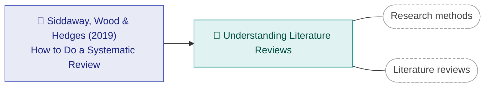

# Library

This is the **knowledge base** — a running map of every paper I read and the article(s) I've written
about it. The blog holds the deep dives; this page keeps the *connections* visible, so a paper is
never an orphan and the reading trail stays navigable.

Each row links the **paper** (to its source) and the **article** (my write-up). Browse by theme on
the [Topics](tags.md) page.

## Reading map

The graph shows how papers connect to articles and to the themes that tie the knowledge base
together. It grows with every post.

## Papers read

| Paper | Area | Article | Read |
|-------|------|---------|------|
| Siddaway, A. P., Wood, A. M., & Hedges, L. V. (2019). *How to Do a Systematic Review: A Best Practice Guide for Conducting and Reporting Narrative Reviews, Meta-Analyses, and Meta-Syntheses.* Annual Review of Psychology, 70, 747–770. [doi](https://doi.org/10.1146/annurev-psych-010418-102803) | Research methods · Literature reviews | [Understanding Literature Reviews](blog/posts/understanding-literature-reviews.md) | Jun 2026 |

!!! tip "How to read this page"
    A paper can map to more than one article over time, and an article can draw on more than one
    paper. As the knowledge base grows, this table and the graph above become a map of how the ideas
    in my research — **AI adoption**, **trust in AI**, and the **organizational context** of
    technology use — fit together.
